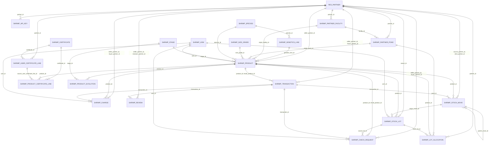

# 🦐 Relaciones de tablas — Módulos de la Camaronera

Documentación de los modelos de **`shrimp_marketplace`** y **`shrimp_user_registry`** y sus relaciones.

> Todos los modelos heredan `shrimp.uuid.mixin`, que agrega el campo alfanumérico `uuid_ref` usado en URLs y API.

## Diagrama entidad–relación

_Las líneas `||--o{` van de **uno** (padre) a **muchos** (hijo con la clave foránea). Las integraciones externas (`res.users`, `ir.attachment`, `sale.order`, `account.move`, `res.currency`, `res.country`) se omiten del diagrama para claridad y se listan en las tablas._

## Relaciones por modelo

Leyenda de tipo: **M2O** = Many2one · **O2M** = One2many · **M2M** = Many2many.

### 🧩 Núcleo

#### `res.partner` — Contacto (vendedor/comprador)  
módulo: `shrimp_user_registry`

| Campo | Tipo | Relacionado con | Inverso |
|---|---|---|---|
| `facility_ids` | O2M | `shrimp.partner.facility` — Instalación | `partner_id` |
| `pond_ids` | O2M | `shrimp.partner.pond` — Piscina | `partner_id` |
| `shrimp_review_ids` | O2M | `shrimp.review` — Reseña | `seller_partner_id` |
| `certificate_line_ids` | O2M | `shrimp.user.certificate.line` — Cert. de usuario (línea) | `partner_id` |
| `sem_photo_attachment_ids` | M2M | `ir.attachment` | — |
| `sem_facility_photo_attachment_ids` | M2M | `ir.attachment` | — |

#### `shrimp.product` — Producto  
módulo: `shrimp_marketplace`

| Campo | Tipo | Relacionado con | Inverso |
|---|---|---|---|
| `seller_partner_id` | M2O | `res.partner` — Contacto (vendedor/comprador) | — |
| `species_id` | M2O | `shrimp.species` — Especie | — |
| `stage_id` | M2O | `shrimp.stage` — Etapa | — |
| `genetics_line_id` | M2O | `shrimp.genetics.line` — Línea genética | — |
| `check_request_ids` | O2M | `shrimp.check.request` — Solicitud de chequeo | `product_id` |
| `uom_id` | M2O | `shrimp.uom` — Unidad de medida | — |
| `size_grade_id` | M2O | `shrimp.size.grade` — Talla | — |
| `cert_attachment_ids` | M2M | `ir.attachment` | — |
| `photo_attachment_ids` | M2M | `ir.attachment` | — |
| `transaction_ids` | O2M | `shrimp.transaction` — Transacción | `product_id` |
| `certificate_line_ids` | O2M | `shrimp.product.certificate.line` — Cert. de producto (línea) | `product_id` |
| `seller_certificate_line_ids` | O2M | `seller_partner_id.certificate_line_ids` | — |
| `stock_lot_ids` | O2M | `shrimp.stock.lot` — Lote de stock | `product_id` |
| `origin_facility_id` | M2O | `shrimp.partner.facility` — Instalación | — |
| `origin_pond_id` | M2O | `shrimp.partner.pond` — Piscina | — |
| `evolution_ids` | O2M | `shrimp.product.evolution` — Evolución del producto | `product_id` |

#### `shrimp.transaction` — Transacción  
módulo: `shrimp_marketplace`

| Campo | Tipo | Relacionado con | Inverso |
|---|---|---|---|
| `product_id` | M2O | `shrimp.product` — Producto | — |
| `seller_partner_id` | M2O | `res.partner` — Contacto (vendedor/comprador) | — |
| `buyer_partner_id` | M2O | `res.partner` — Contacto (vendedor/comprador) | — |
| `invoice_attachment_ids` | M2M | `ir.attachment` | — |
| `stock_move_ids` | O2M | `shrimp.stock.move` — Movimiento de stock | `transaction_id` |
| `result_product_id` | M2O | `shrimp.product` — Producto | — |

### 📚 Catálogos maestros

#### `shrimp.certificate` — Certificado (catálogo)  
módulo: `shrimp_user_registry`

_Tabla maestra / sin relaciones salientes (solo referenciada por otros)._

#### `shrimp.genetics.line` — Línea genética  
módulo: `shrimp_marketplace`

| Campo | Tipo | Relacionado con | Inverso |
|---|---|---|---|
| `species_id` | M2O | `shrimp.species` — Especie | — |

#### `shrimp.size.grade` — Talla  
módulo: `shrimp_marketplace`

_Tabla maestra / sin relaciones salientes (solo referenciada por otros)._

#### `shrimp.species` — Especie  
módulo: `shrimp_marketplace`

_Tabla maestra / sin relaciones salientes (solo referenciada por otros)._

#### `shrimp.stage` — Etapa  
módulo: `shrimp_marketplace`

_Tabla maestra / sin relaciones salientes (solo referenciada por otros)._

#### `shrimp.uom` — Unidad de medida  
módulo: `shrimp_marketplace`

_Tabla maestra / sin relaciones salientes (solo referenciada por otros)._

### 🏝️ Infraestructura física

#### `shrimp.partner.facility` — Instalación  
módulo: `shrimp_marketplace`

| Campo | Tipo | Relacionado con | Inverso |
|---|---|---|---|
| `partner_id` | M2O | `res.partner` — Contacto (vendedor/comprador) | — |
| `country_id` | M2O | `res.country` | — |
| `pond_ids` | O2M | `shrimp.partner.pond` — Piscina | `facility_id` |

#### `shrimp.partner.pond` — Piscina  
módulo: `shrimp_marketplace`

| Campo | Tipo | Relacionado con | Inverso |
|---|---|---|---|
| `partner_id` | M2O | `res.partner` — Contacto (vendedor/comprador) | — |
| `facility_id` | M2O | `shrimp.partner.facility` — Instalación | — |
| `lot_allocation_ids` | O2M | `shrimp.lot.allocation` — Asignación lote↔piscina | `pond_id` |

### 📦 Stock / lotes

#### `shrimp.lot.allocation` — Asignación lote↔piscina  
módulo: `shrimp_marketplace`

| Campo | Tipo | Relacionado con | Inverso |
|---|---|---|---|
| `stock_lot_id` | M2O | `shrimp.stock.lot` — Lote de stock | — |
| `pond_id` | M2O | `shrimp.partner.pond` — Piscina | — |
| `partner_id` | M2O | `res.partner` — Contacto (vendedor/comprador) | — |
| `product_id` | M2O | `shrimp.product` — Producto | — |

#### `shrimp.stock.lot` — Lote de stock  
módulo: `shrimp_marketplace`

| Campo | Tipo | Relacionado con | Inverso |
|---|---|---|---|
| `product_id` | M2O | `shrimp.product` — Producto | — |
| `owner_id` | M2O | `res.partner` — Contacto (vendedor/comprador) | — |
| `origin_move_id` | M2O | `shrimp.stock.move` — Movimiento de stock | — |
| `uom_id` | M2O | `shrimp.uom` — Unidad de medida | — |

#### `shrimp.stock.move` — Movimiento de stock  
módulo: `shrimp_marketplace`

| Campo | Tipo | Relacionado con | Inverso |
|---|---|---|---|
| `product_id` | M2O | `shrimp.product` — Producto | — |
| `source_partner_id` | M2O | `res.partner` — Contacto (vendedor/comprador) | — |
| `dest_partner_id` | M2O | `res.partner` — Contacto (vendedor/comprador) | — |
| `parent_move_id` | M2O | `shrimp.stock.move` — Movimiento de stock | — |
| `transaction_id` | M2O | `shrimp.transaction` — Transacción | — |

### 💳 Transaccional

#### `shrimp.charge` — Cobro / comisión  
módulo: `shrimp_marketplace`

| Campo | Tipo | Relacionado con | Inverso |
|---|---|---|---|
| `transaction_id` | M2O | `shrimp.transaction` — Transacción | — |
| `seller_partner_id` | M2O | `res.partner` — Contacto (vendedor/comprador) | — |
| `buyer_partner_id` | M2O | `res.partner` — Contacto (vendedor/comprador) | — |
| `product_id` | M2O | `shrimp.product` — Producto | — |
| `uom_id` | M2O | `shrimp.uom` — Unidad de medida | — |
| `currency_id` | M2O | `res.currency` | — |
| `sale_order_id` | M2O | `sale.order` | — |
| `invoice_id` | M2O | `account.move` | — |

#### `shrimp.check.request` — Solicitud de chequeo  
módulo: `shrimp_marketplace`

| Campo | Tipo | Relacionado con | Inverso |
|---|---|---|---|
| `product_id` | M2O | `shrimp.product` — Producto | — |
| `seller_partner_id` | M2O | `res.partner` — Contacto (vendedor/comprador) | — |
| `buyer_partner_id` | M2O | `res.partner` — Contacto (vendedor/comprador) | — |
| `uom_id` | M2O | `shrimp.uom` — Unidad de medida | — |
| `transaction_id` | M2O | `shrimp.transaction` — Transacción | — |
| `source_lot_id` | M2O | `shrimp.stock.lot` — Lote de stock | — |
| `result_product_id` | M2O | `shrimp.product` — Producto | — |
| `reviewed_by` | M2O | `res.users` | — |
| `currency_id` | M2O | `res.currency` | — |
| `sale_order_id` | M2O | `sale.order` | — |
| `invoice_id` | M2O | `account.move` | — |

#### `shrimp.review` — Reseña  
módulo: `shrimp_marketplace`

| Campo | Tipo | Relacionado con | Inverso |
|---|---|---|---|
| `seller_partner_id` | M2O | `res.partner` — Contacto (vendedor/comprador) | — |
| `reviewer_partner_id` | M2O | `res.partner` — Contacto (vendedor/comprador) | — |
| `transaction_id` | M2O | `shrimp.transaction` — Transacción | — |

### 📜 Certificados

#### `shrimp.product.certificate.line` — Cert. de producto (línea)  
módulo: `shrimp_marketplace`

| Campo | Tipo | Relacionado con | Inverso |
|---|---|---|---|
| `product_id` | M2O | `shrimp.product` — Producto | — |
| `source_user_certificate_line_id` | M2O | `shrimp.user.certificate.line` — Cert. de usuario (línea) | — |
| `certificate_id` | M2O | `shrimp.certificate` — Certificado (catálogo) | — |
| `attachment_id` | M2O | `ir.attachment` | — |

#### `shrimp.user.certificate.line` — Cert. de usuario (línea)  
módulo: `shrimp_user_registry`

| Campo | Tipo | Relacionado con | Inverso |
|---|---|---|---|
| `partner_id` | M2O | `res.partner` — Contacto (vendedor/comprador) | — |
| `certificate_id` | M2O | `shrimp.certificate` — Certificado (catálogo) | — |
| `file_attachment_id` | M2O | `ir.attachment` | — |

### 🧬 Trazabilidad

#### `shrimp.product.evolution` — Evolución del producto  
módulo: `shrimp_marketplace`

| Campo | Tipo | Relacionado con | Inverso |
|---|---|---|---|
| `product_id` | M2O | `shrimp.product` — Producto | — |
| `stage_id` | M2O | `shrimp.stage` — Etapa | — |
| `user_id` | M2O | `res.users` | — |

### ⚙️ Otros

#### `shrimp.api.key` — API key  
módulo: `shrimp_marketplace`

| Campo | Tipo | Relacionado con | Inverso |
|---|---|---|---|
| `user_id` | M2O | `res.users` | — |
| `partner_id` | M2O | `res.partner` — Contacto (vendedor/comprador) | — |

#### `shrimp.uuid.mixin` — Mixin UUID (abstracto)  
módulo: `shrimp_user_registry`

_Tabla maestra / sin relaciones salientes (solo referenciada por otros)._

